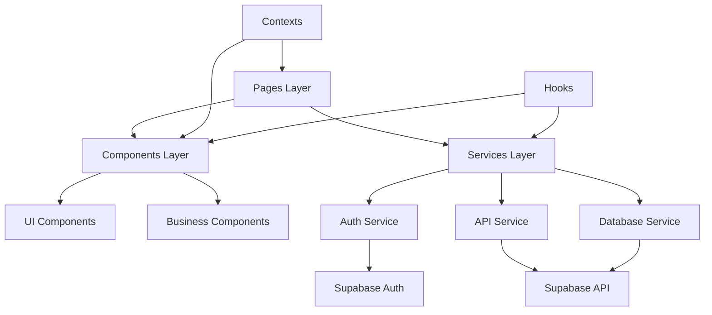
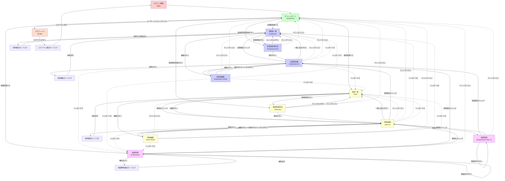
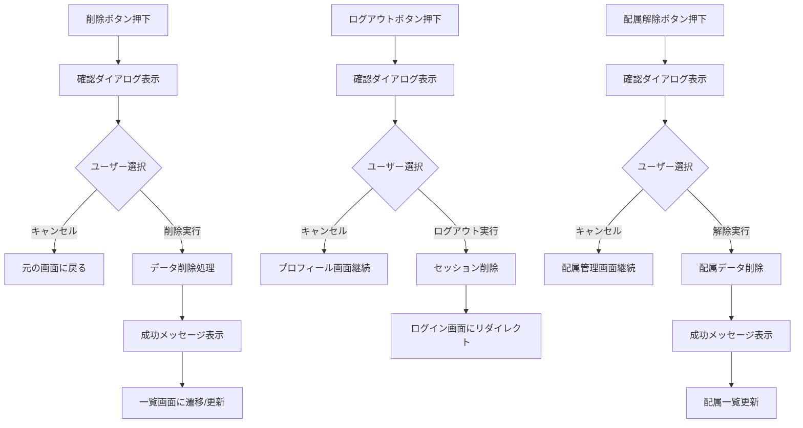
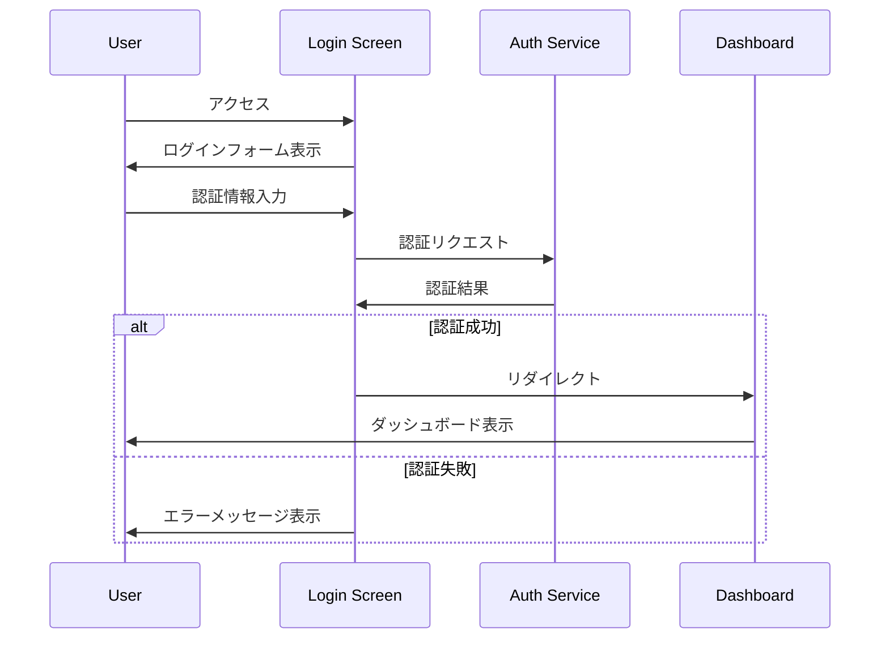
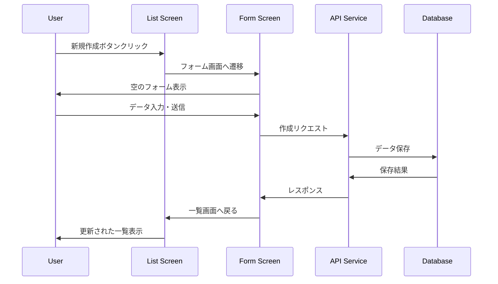

# Design Document

## Overview

従業員管理システムのフロントエンドは、React Native、Material-UI、TypeScriptを使用したモダンなWebアプリケーションとして設計されます。Supabaseを認証・データベースとして活用し、microk8s上のPodで動作する開発環境と、Vercelでの本番デプロイメントに対応した構成となります。

## Steering Document Alignment

### Technical Standards (tech.md)
- **フレームワーク**: React Native Web (Web対応), TypeScript
- **UIライブラリ**: Material-UI (MUI) v5
- **状態管理**: React Context API + React Query (サーバー状態)
- **認証**: Supabase Auth
- **データベース接続**: Supabase Client
- **テスト**: Vitest (単体テスト), Playwright (E2E)
- **ビルドツール**: Vite

### Project Structure (structure.md)
モジュラー設計に基づく階層化アーキテクチャ：
- `src/components/` - 再利用可能UIコンポーネント
- `src/pages/` - ページコンポーネント
- `src/services/` - API・認証サービス
- `src/hooks/` - カスタムReactフック
- `src/types/` - TypeScript型定義
- `src/utils/` - ユーティリティ関数
- `src/contexts/` - Reactコンテキスト

## Code Reuse Analysis

### Existing Components to Leverage
プロジェクトが新規のため、以下の標準ライブラリを基盤として活用：
- **Material-UI Components**: Button, TextField, Table, Dialog, Snackbar等の基本コンポーネント
- **React Router**: ページナビゲーション
- **React Query**: データフェッチングとキャッシュ管理
- **Supabase Client**: 認証とデータベース操作

### Integration Points
- **Supabase Database**: employees, sites, assignmentsテーブルとの連携
- **Supabase Auth**: JWT認証とユーザーセッション管理
- **Material-UI Theme**: 一貫したデザインシステム
- **React Native Web**: Web環境でのモバイル体験提供

## Architecture

システムはレイヤード・アーキテクチャパターンを採用し、関心の分離と保守性を重視した設計とします。

### Modular Design Principles
- **Single File Responsibility**: 各ファイルは単一のドメインまたは機能を担当
- **Component Isolation**: 小さく集中したコンポーネントを作成し、大きなモノリシックファイルを避ける
- **Service Layer Separation**: データアクセス、ビジネスロジック、プレゼンテーション層を分離
- **Utility Modularity**: ユーティリティを集中した単一目的のモジュールに分割



## Components and Interfaces

### AuthProvider Context
- **Purpose:** 認証状態の管理とアプリケーション全体での共有
- **Interfaces:**
  - `login(email: string, password: string): Promise<void>`
  - `logout(): Promise<void>`
  - `user: User | null`
  - `loading: boolean`
- **Dependencies:** Supabase Auth Client
- **Reuses:** Supabase認証ライブラリ

### EmployeeList Component
- **Purpose:** 従業員一覧の表示、検索、フィルタリング機能
- **Interfaces:**
  - `onEmployeeSelect(employee: Employee): void`
  - `onEmployeeEdit(employee: Employee): void`
  - `onEmployeeDelete(employeeId: string): void`
- **Dependencies:** Material-UI Table, Search Components
- **Reuses:** MUI DataGrid, 共通検索コンポーネント

### EmployeeForm Component
- **Purpose:** 従業員の新規登録・編集フォーム
- **Interfaces:**
  - `employee?: Employee` (編集時)
  - `onSubmit(employee: EmployeeFormData): void`
  - `onCancel(): void`
- **Dependencies:** Material-UI Form Components, React Hook Form
- **Reuses:** MUI TextField, Button, Form validation utilities

### SiteList Component
- **Purpose:** 現場一覧の表示、検索機能
- **Interfaces:**
  - `onSiteSelect(site: Site): void`
  - `onSiteEdit(site: Site): void`
  - `onSiteDelete(siteId: string): void`
- **Dependencies:** Material-UI Table Components
- **Reuses:** MUI DataGrid, 検索コンポーネント

### SiteForm Component
- **Purpose:** 現場の新規登録・編集フォーム
- **Interfaces:**
  - `site?: Site` (編集時)
  - `onSubmit(site: SiteFormData): void`
  - `onCancel(): void`
- **Dependencies:** Material-UI Form Components
- **Reuses:** MUI TextField, Button, DatePicker

### AssignmentManager Component
- **Purpose:** 従業員と現場の配属管理
- **Interfaces:**
  - `onAssignmentCreate(assignment: AssignmentFormData): void`
  - `onAssignmentDelete(assignmentId: string): void`
- **Dependencies:** Material-UI Select, Autocomplete
- **Reuses:** MUI Select, Autocomplete, DateRangePicker

### Navigation Component
- **Purpose:** アプリケーションのメインナビゲーション
- **Interfaces:**
  - `currentPage: string`
  - `onNavigate(page: string): void`
- **Dependencies:** Material-UI AppBar, Drawer
- **Reuses:** MUI Navigation components

## Screen Design

### Screen Layout Structure
全画面は統一されたレイアウト構造を持ち、Material-UIのBox layoutとGrid systemを活用します：

```
┌─────────────────────────────────┐
│          Header/AppBar          │
│  [Logo] [Navigation] [User Menu]│
├─────────────────────────────────┤
│        │                       │
│ Side   │     Main Content      │
│ Nav    │     Area              │
│ (opt)  │                       │
│        │                       │
├─────────────────────────────────┤
│            Footer               │
│       [Copyright Info]          │
└─────────────────────────────────┘
```

### Detailed Screen Layouts and Navigation

#### 1. ログイン画面 (`/login`)
**詳細レイアウト**:
```
┌─────────────────────────────────┐
│                                 │
│       [会社ロゴ]                │
│    従業員管理システム           │
│                                 │
│  ┌─────────────────────────┐   │
│  │  メールアドレス         │   │
│  │  [________________]     │   │
│  │                         │   │
│  │  パスワード             │   │
│  │  [________________]     │   │
│  │                         │   │
│  │  [ログイン] ボタン      │   │
│  │                         │   │
│  │  [エラーメッセージ領域] │   │
│  └─────────────────────────┘   │
│                                 │
└─────────────────────────────────┘
```
**ボタン・リンク・遷移**:
- `[ログイン]` ボタン → `/dashboard` (認証成功時)
- 認証失敗時 → 同じ画面でエラーメッセージ表示

#### 2. ダッシュボード画面 (`/dashboard`)
**詳細レイアウト**:
```
┌─────────────────────────────────┐
│ [ロゴ] 従業員管理  [ユーザー▼] │ ヘッダー
├─────────────────────────────────┤
│ ダッシュボード                  │ パンくずリスト
├─────────────────────────────────┤
│ ┌─────────┐ ┌─────────┐ ┌─────┐ │
│ │従業員数  │ │現場数   │ │配属 │ │ 統計カード
│ │  123人  │ │  45件   │ │ 78件│ │
│ └─────────┘ └─────────┘ └─────┘ │
│                                 │
│ クイックアクション              │
│ [新規従業員登録] [新規現場登録] │
│                                 │
│ 最近の活動                      │
│ ┌─────────────────────────────┐ │
│ │ 田中太郎 が東京現場に配属    │ │
│ │ 新現場「大阪プロジェクト」   │ │
│ │ 佐藤花子 の情報を更新       │ │
│ └─────────────────────────────┘ │
└─────────────────────────────────┘
```
**ボタン・リンク・遷移**:
- `[新規従業員登録]` ボタン → `/employees/new`
- `[新規現場登録]` ボタン → `/sites/new`
- ヘッダーナビゲーション:
  - `従業員管理` → `/employees`
  - `現場管理` → `/sites`
  - `配属管理` → `/assignments`
- ユーザーメニュー: `[ユーザー▼]` → プロフィール `/profile`, ログアウト

#### 3. 従業員一覧画面 (`/employees`)
**詳細レイアウト**:
```
┌─────────────────────────────────┐
│ [ロゴ] 従業員管理  [ユーザー▼] │ ヘッダー
├─────────────────────────────────┤
│ ダッシュボード > 従業員管理     │ パンくずリスト
├─────────────────────────────────┤
│ 検索・フィルター                │
│ [検索: 名前,部署,役職 ________] │
│ 部署:[全て▼] 状況:[全て▼]      │
│                                 │
│ [新規登録] [エクスポート]       │
├─────────────────────────────────┤
│ 従業員一覧テーブル              │
│ ┌────┬──────┬────┬────┬────┐ │
│ │名前  │部署    │役職  │状況│操作│ │
│ ├────┼──────┼────┼────┼────┤ │
│ │田中太│開発部  │SE   │在籍│[編]│ │
│ │郎    │        │     │    │[削]│ │
│ ├────┼──────┼────┼────┼────┤ │
│ │佐藤花│営業部  │主任 │在籍│[編]│ │
│ │子    │        │     │    │[削]│ │
│ └────┴──────┴────┴────┴────┘ │
│          [< 前へ]  1  [次へ >]   │ ページネーション
└─────────────────────────────────┘
```
**ボタン・リンク・遷移**:
- `[新規登録]` ボタン → `/employees/new`
- `[エクスポート]` ボタン → CSV/Excel ダウンロード (同じ画面)
- 各行の `[編]` ボタン → `/employees/{id}/edit`
- 各行の `[削]` ボタン → 削除確認ダイアログ → 削除実行 (同じ画面で更新)
- 従業員名クリック → `/employees/{id}` (詳細画面)

#### 4. 従業員詳細画面 (`/employees/:id`)
**詳細レイアウト**:
```
┌─────────────────────────────────┐
│ [ロゴ] 従業員管理  [ユーザー▼] │ ヘッダー
├─────────────────────────────────┤
│ ダッシュボード > 従業員管理 >   │ パンくずリスト
│ 従業員詳細 (田中太郎)           │
├─────────────────────────────────┤
│ ┌─────────────────────────────┐ │
│ │ 基本情報              [編集]│ │
│ │ 名前: 田中 太郎            │ │
│ │ メール: tanaka@example.com │ │
│ │ 部署: 開発部              │ │
│ │ 役職: SE                  │ │
│ │ 入社日: 2023-04-01        │ │
│ │ 状況: 在籍                │ │
│ └─────────────────────────────┘ │
│                                 │
│ 現在の配属状況                  │
│ ┌─────────────────────────────┐ │
│ │ 東京プロジェクト            │ │
│ │ 配属日: 2024-01-15          │ │
│ │ 役割: メイン開発者          │ │
│ └─────────────────────────────┘ │
│                                 │
│ 配属履歴                        │
│ ┌────┬──────────┬────────┐   │
│ │現場  │配属期間        │役割    │   │
│ ├────┼──────────┼────────┤   │
│ │東京  │2024-01-15 -    │メイン  │   │
│ │大阪  │2023-04-01 -    │サブ    │   │
│ │      │2023-12-31      │        │   │
│ └────┴──────────┴────────┘   │
│                                 │
│ [編集] [削除] [一覧に戻る]     │
└─────────────────────────────────┘
```
**ボタン・リンク・遷移**:
- `[編集]` ボタン (ヘッダー内) → `/employees/{id}/edit`
- `[編集]` ボタン (下部) → `/employees/{id}/edit`
- `[削除]` ボタン → 削除確認ダイアログ → `/employees` (削除後一覧に戻る)
- `[一覧に戻る]` ボタン → `/employees`
- パンくずリスト `従業員管理` → `/employees`

#### 5. 従業員フォーム画面 (`/employees/new`, `/employees/:id/edit`)
**詳細レイアウト**:
```
┌─────────────────────────────────┐
│ [ロゴ] 従業員管理  [ユーザー▼] │ ヘッダー
├─────────────────────────────────┤
│ ダッシュボード > 従業員管理 >   │ パンくずリスト
│ 従業員登録/編集                │
├─────────────────────────────────┤
│ ┌───────────────┬─────────────┐ │ 2カラム
│ │ 姓 *            │ 名 *        │ │ レイアウト
│ │ [_____________] │ [_________] │ │
│ │                 │             │ │
│ │ メールアドレス * │ 電話番号    │ │
│ │ [_____________] │ [_________] │ │
│ │                 │             │ │
│ │ 部署 *          │ 役職 *      │ │
│ │ [開発部▼]      │ [SE▼]      │ │
│ │                 │             │ │
│ │ 入社日 *        │ 状況        │ │
│ │ [2024-01-01]   │ [在籍▼]    │ │
│ └───────────────┴─────────────┘ │
│                                 │
│ * 必須項目                      │
│ [エラーメッセージ領域]          │
│                                 │
│ [保存] [キャンセル]             │
└─────────────────────────────────┘
```
**ボタン・リンク・遷移**:
- `[保存]` ボタン →
  - 新規作成時: データ保存後 `/employees/{新しいid}` (詳細画面)
  - 編集時: データ保存後 `/employees/{id}` (詳細画面)
  - バリデーションエラー時: 同じ画面でエラー表示
- `[キャンセル]` ボタン →
  - 新規作成時: `/employees`
  - 編集時: `/employees/{id}`

#### 6. 現場一覧画面 (`/sites`)
**詳細レイアウト**:
```
┌─────────────────────────────────┐
│ [ロゴ] 従業員管理  [ユーザー▼] │ ヘッダー
├─────────────────────────────────┤
│ ダッシュボード > 現場管理       │ パンくずリスト
├─────────────────────────────────┤
│ 検索・フィルター                │
│ [検索: 現場名,所在地 ________]  │
│ ステータス:[全て▼] [🔍検索]    │
│                                 │
│ [新規登録] [表示切替: カード▼] │
├─────────────────────────────────┤
│ 現場一覧 (カード表示)           │
│ ┌─────────────┐ ┌─────────────┐ │
│ │東京プロジェクト│ │大阪プロジェクト│ │
│ │場所: 東京都   │ │場所: 大阪府   │ │
│ │状況: 進行中   │ │状況: 完了     │ │
│ │期間: 2024-   │ │期間: 2023-2024│ │
│ │[詳細][編集]   │ │[詳細][編集]   │ │
│ └─────────────┘ └─────────────┘ │
│ ┌─────────────┐               │
│ │福岡プロジェクト│               │
│ │場所: 福岡県   │               │
│ │状況: 準備中   │               │
│ │期間: 2024-   │               │
│ │[詳細][編集]   │               │
│ └─────────────┘               │
│          [< 前へ]  1  [次へ >]   │
└─────────────────────────────────┘
```
**ボタン・リンク・遷移**:
- `[新規登録]` ボタン → `/sites/new`
- `[表示切替]` セレクト → カード表示/テーブル表示 (同じ画面)
- 各カードの `[詳細]` ボタン → `/sites/{id}`
- 各カードの `[編集]` ボタン → `/sites/{id}/edit`
- 現場名クリック → `/sites/{id}`

#### 7. 現場詳細画面 (`/sites/:id`)
**詳細レイアウト**:
```
┌─────────────────────────────────┐
│ [ロゴ] 従業員管理  [ユーザー▼] │ ヘッダー
├─────────────────────────────────┤
│ ダッシュボード > 現場管理 >     │ パンくずリスト
│ 現場詳細 (東京プロジェクト)     │
├─────────────────────────────────┤
│ ┌─────────────────────────────┐ │
│ │ 現場情報              [編集]│ │
│ │ 現場名: 東京プロジェクト    │ │
│ │ 所在地: 東京都千代田区      │ │
│ │ 開始日: 2024-01-01          │ │
│ │ 終了日: 未定                │ │
│ │ 状況: 進行中                │ │
│ │ 責任者: 山田部長            │ │
│ │ 説明: 新システム開発        │ │
│ └─────────────────────────────┘ │
│                                 │
│ 配属従業員 (3名)        [配属] │
│ ┌────┬────────┬──────────┐   │
│ │名前  │役割        │配属期間    │   │
│ ├────┼────────┼──────────┤   │
│ │田中太│メイン開発  │2024-01-15- │   │
│ │佐藤花│サブ開発    │2024-02-01- │   │
│ │鈴木一│テスター    │2024-01-15- │   │
│ └────┴────────┴──────────┘   │
│                                 │
│ [編集] [削除] [一覧に戻る]     │
└─────────────────────────────────┘
```
**ボタン・リンク・遷移**:
- `[編集]` ボタン (ヘッダー内) → `/sites/{id}/edit`
- `[配属]` ボタン → `/assignments?site={id}` (配属管理画面で現場を事前選択)
- `[編集]` ボタン (下部) → `/sites/{id}/edit`
- `[削除]` ボタン → 削除確認ダイアログ → `/sites` (削除後一覧に戻る)
- `[一覧に戻る]` ボタン → `/sites`
- 従業員名クリック → `/employees/{employee_id}`

#### 8. 現場フォーム画面 (`/sites/new`, `/sites/:id/edit`)
**詳細レイアウト**:
```
┌─────────────────────────────────┐
│ [ロゴ] 従業員管理  [ユーザー▼] │ ヘッダー
├─────────────────────────────────┤
│ ダッシュボード > 現場管理 >     │ パンくずリスト
│ 現場登録/編集                  │
├─────────────────────────────────┤
│ ┌─────────────────────────────┐ │ シングル
│ │ 現場名 *                    │ │ カラム
│ │ [_________________________] │ │ レイアウト
│ │                             │ │
│ │ 所在地 *                    │ │
│ │ [_________________________] │ │
│ │                             │ │
│ │ 開始日 *      終了日        │ │
│ │ [2024-01-01] [2024-12-31]  │ │
│ │                             │ │
│ │ 状況 *                      │ │
│ │ [進行中▼]                  │ │
│ │                             │ │
│ │ 現場責任者名                │ │
│ │ [_________________________] │ │
│ │                             │ │
│ │ 説明                        │ │
│ │ [_________________________] │ │
│ │ [_________________________] │ │
│ │ [_________________________] │ │
│ └─────────────────────────────┘ │
│                                 │
│ * 必須項目                      │
│ [エラーメッセージ領域]          │
│                                 │
│ [保存] [キャンセル]             │
└─────────────────────────────────┘
```
**ボタン・リンク・遷移**:
- `[保存]` ボタン →
  - 新規作成時: データ保存後 `/sites/{新しいid}` (詳細画面)
  - 編集時: データ保存後 `/sites/{id}` (詳細画面)
  - バリデーションエラー時: 同じ画面でエラー表示
- `[キャンセル]` ボタン →
  - 新規作成時: `/sites`
  - 編集時: `/sites/{id}`

#### 9. 配属管理画面 (`/assignments`)
**詳細レイアウト**:
```
┌─────────────────────────────────┐
│ [ロゴ] 従業員管理  [ユーザー▼] │ ヘッダー
├─────────────────────────────────┤
│ ダッシュボード > 配属管理       │ パンくずリスト
├─────────────────────────────────┤
│ 新規配属                        │
│ ┌─────────────────────────────┐ │
│ │ 従業員選択 *                │ │
│ │ [田中太郎を入力...        ▼] │ │ オート
│ │                             │ │ コンプリート
│ │ 現場選択 *                  │ │
│ │ [東京プロジェクトを入力... ▼] │ │
│ │                             │ │
│ │ 配属期間                    │ │
│ │ 開始日: [2024-01-01]        │ │
│ │ 終了日: [         ] (任意) │ │
│ │                             │ │
│ │ 役割                        │ │
│ │ [メイン開発者]              │ │
│ │                             │ │
│ │        [配属実行]           │ │
│ └─────────────────────────────┘ │
│                                 │
│ 現在の配属一覧                  │
│ [検索: 従業員名,現場名 ______] │
│ ┌────┬──────┬────┬────────┐ │
│ │従業員│現場    │役割  │配属期間  │操作│
│ ├────┼──────┼────┼────────┼──┤
│ │田中太│東京    │メイン│2024-01-15│[解]│
│ │佐藤花│大阪    │サブ  │2024-02-01│[解]│
│ │鈴木一│東京    │テスト│2024-01-15│[解]│
│ └────┴──────┴────┴────────┴──┘
│          [< 前へ]  1  [次へ >]   │
└─────────────────────────────────┘
```
**ボタン・リンク・遷移**:
- `[配属実行]` ボタン → 配属データ保存 → 同じ画面で配属一覧更新
- 各行の `[解]` (解除) ボタン → 配属解除確認ダイアログ → 解除実行 (同じ画面で更新)
- 従業員名クリック → `/employees/{employee_id}`
- 現場名クリック → `/sites/{site_id}`
- URLパラメータ対応:
  - `?employee={id}` → 従業員を事前選択状態
  - `?site={id}` → 現場を事前選択状態

#### 10. ユーザープロフィール画面 (`/profile`)
**詳細レイアウト**:
```
┌─────────────────────────────────┐
│ [ロゴ] 従業員管理  [ユーザー▼] │ ヘッダー
├─────────────────────────────────┤
│ ダッシュボード > プロフィール   │ パンくずリスト
├─────────────────────────────────┤
│ [アカウント] [設定] [ログアウト]│ タブ
├─────────────────────────────────┤
│ アカウント設定                  │
│ ┌─────────────────────────────┐ │
│ │ 現在のメールアドレス        │ │
│ │ user@example.com            │ │
│ │                             │ │
│ │ パスワード変更              │ │
│ │ 現在のパスワード *          │ │
│ │ [_________________________] │ │
│ │                             │ │
│ │ 新しいパスワード *          │ │
│ │ [_________________________] │ │
│ │                             │ │
│ │ パスワード確認 *            │ │
│ │ [_________________________] │ │
│ │                             │ │
│ │     [パスワード変更]        │ │
│ └─────────────────────────────┘ │
│                                 │
│ 表示設定                        │
│ ┌─────────────────────────────┐ │
│ │ 言語: [日本語▼]            │ │
│ │ テーマ: [ライト▼]          │ │
│ │                             │ │
│ │     [設定保存]              │ │
│ └─────────────────────────────┘ │
│                                 │
│ [ログアウト]                    │
└─────────────────────────────────┘
```
**ボタン・リンク・遷移**:
- `[パスワード変更]` ボタン → パスワード更新 → 同じ画面で成功メッセージ
- `[設定保存]` ボタン → 設定保存 → 同じ画面で成功メッセージ
- `[ログアウト]` ボタン → 確認ダイアログ → `/login` (ログアウト実行)
- タブ切り替え: 各タブクリックで同じ画面内でコンテンツ切り替え

## Screen Transition Design

### Detailed Navigation Flow Diagram


### Button-Specific Navigation Map

#### 確認ダイアログの詳細


### Authentication Flow


### CRUD Operation Flow


### Navigation Rules and Guards

#### Route Protection
1. **認証が必要なルート**: `/dashboard`, `/employees/*`, `/sites/*`, `/assignments/*`, `/profile`
   - 未認証ユーザーは自動的に`/login`にリダイレクト
   - 認証状態はローカルストレージのJWTトークンで管理

2. **管理者限定ルート**: 削除操作、一括操作
   - 権限不足時は操作ボタンを非活性化
   - アクセス試行時は警告メッセージ表示

#### Breadcrumb Navigation
階層的なページには breadcrumb を表示：
```
ダッシュボード > 従業員管理 > 従業員詳細 (田中太郎)
ダッシュボード > 現場管理 > 現場編集 (東京プロジェクト)
```

#### State Management for Navigation
- **URL State**: React Router を使用したルート管理
- **Navigation History**: ブラウザ履歴を活用
- **Tab State**: 各画面内のタブ状態は URL パラメータで管理
- **Filter State**: 検索・フィルター条件は URL クエリパラメータで管理

#### Mobile Responsive Navigation
- **768px以下**: ハンバーガーメニューに切り替え
- **Touch Navigation**: スワイプジェスチャーでサイドメニュー開閉
- **Responsive Tables**: 小画面では重要な列のみ表示、詳細は展開で確認

## Data Models

### Employee Model
```typescript
interface Employee {
  id: string;                    // UUID
  first_name: string;           // 名前
  last_name: string;            // 姓
  email: string;                // メールアドレス（ユニーク）
  phone?: string;               // 電話番号（オプション）
  department: string;           // 部署
  position: string;             // 役職
  hire_date: Date;              // 入社日
  status: 'active' | 'inactive'; // 在籍状況
  created_at: Date;             // 作成日時
  updated_at: Date;             // 更新日時
}
```

### Site Model
```typescript
interface Site {
  id: string;                   // UUID
  name: string;                 // 現場名
  description?: string;         // 説明（オプション）
  location: string;             // 所在地
  start_date: Date;             // 開始日
  end_date?: Date;              // 終了日（オプション）
  status: 'active' | 'completed' | 'suspended'; // 現場状況
  manager_name?: string;        // 現場責任者名（オプション）
  created_at: Date;             // 作成日時
  updated_at: Date;             // 更新日時
}
```

### Assignment Model
```typescript
interface Assignment {
  id: string;                   // UUID
  employee_id: string;          // 従業員ID（外部キー）
  site_id: string;              // 現場ID（外部キー）
  start_date: Date;             // 配属開始日
  end_date?: Date;              // 配属終了日（オプション）
  role?: string;                // 現場での役割（オプション）
  notes?: string;               // 備考（オプション）
  created_at: Date;             // 作成日時
  updated_at: Date;             // 更新日時
  // リレーション
  employee?: Employee;          // 従業員情報
  site?: Site;                  // 現場情報
}
```

## Error Handling

### Error Scenarios
1. **認証エラー**
   - **Handling:** AuthContextでエラーを捕捉し、ログイン画面へリダイレクト
   - **User Impact:** 「認証に失敗しました。再度ログインしてください」メッセージ表示

2. **データベース接続エラー**
   - **Handling:** React QueryのonError設定でエラーを処理し、リトライ機能を提供
   - **User Impact:** 「サーバーに接続できません。しばらく待ってから再試行してください」

3. **バリデーションエラー**
   - **Handling:** React Hook Formのバリデーション機能とzodスキーマでフォーム検証
   - **User Impact:** 各入力フィールドの下に具体的なエラーメッセージを表示

4. **権限エラー**
   - **Handling:** APIレスポンスをチェックし、403エラー時は権限不足メッセージを表示
   - **User Impact:** 「この操作を実行する権限がありません」メッセージ表示

5. **重複データエラー**
   - **Handling:** データベース制約違反を捕捉し、ユーザーフレンドリーなメッセージに変換
   - **User Impact:** 「このメールアドレスは既に登録されています」等の具体的なメッセージ

## Testing Strategy

### Unit Testing
- **アプローチ**: Vitestを使用したコンポーネント・関数単位のテスト
- **主要テスト対象**:
  - 各Reactコンポーネントのレンダリングテスト
  - カスタムフックの状態管理テスト
  - ユーティリティ関数の入出力テスト
  - サービス層のAPIコール・エラーハンドリングテスト
- **カバレッジ目標**: 100%

### Integration Testing
- **アプローチ**: React Testing Libraryを使用したコンポーネント間の連携テスト
- **主要テストフロー**:
  - 認証フローとページ遷移
  - CRUD操作の完全なデータフロー
  - フォーム送信からデータベース保存まで
  - 検索・フィルタリング機能

### End-to-End Testing
- **アプローチ**: Playwrightを使用したブラウザベースの自動化テスト
- **ユーザーシナリオ**:
  - ログインから従業員登録・編集・削除の完全フロー
  - 現場管理の全操作シナリオ
  - 配属作成・管理・解除のフロー
  - 検索・フィルタリング・一覧表示の確認
  - レスポンシブデザインとアクセシビリティの検証

### Performance Testing
- **アプローチ**: Lighthouse、Web Vitalsを使用した性能測定
- **測定項目**:
  - ページ読み込み時間
  - インタラクティブまでの時間
  - バンドルサイズ
  - メモリ使用量
  - Core Web Vitals (LCP, FID, CLS)

## Backend API Specification

フロントエンドが期待するバックエンドAPI仕様を定義します。現在はSupabaseを使用していますが、将来的な独自API移行を考慮した設計とします。

### API Base Configuration

```typescript
// APIベース設定
const API_BASE_URL = process.env.VITE_API_BASE_URL || 'https://your-supabase-url.supabase.co'
const API_VERSION = 'v1'
const API_ENDPOINTS = {
  employees: `/rest/${API_VERSION}/employees`,
  sites: `/rest/${API_VERSION}/sites`,
  assignments: `/rest/${API_VERSION}/assignments`,
  auth: `/auth/${API_VERSION}`
}
```

### Authentication APIs

#### POST /auth/v1/token
**Purpose**: ユーザー認証とJWTトークン取得
**Called from**: `src/hooks/useAuth.ts` - `signIn()`

```typescript
// Request
interface LoginRequest {
  email: string;
  password: string;
}

// Response
interface LoginResponse {
  access_token: string;
  token_type: 'bearer';
  expires_in: number;
  refresh_token: string;
  user: {
    id: string;
    email: string;
    user_metadata?: {
      first_name?: string;
      last_name?: string;
    };
  };
}
```

#### POST /auth/v1/signup
**Purpose**: 新規ユーザー登録
**Called from**: `src/hooks/useAuth.ts` - `signUp()`

```typescript
// Request
interface SignupRequest {
  email: string;
  password: string;
  data?: {
    first_name?: string;
    last_name?: string;
  };
}

// Response: Same as LoginResponse
```

#### POST /auth/v1/logout
**Purpose**: ログアウト処理
**Called from**: `src/hooks/useAuth.ts` - `signOut()`

```typescript
// Request: No body (JWT in Authorization header)
// Response
interface LogoutResponse {
  message: string;
}
```

#### GET /auth/v1/user
**Purpose**: 現在のユーザー情報取得
**Called from**: `src/hooks/useAuth.ts` - `getCurrentUser()`

```typescript
// Response
interface UserResponse {
  user: {
    id: string;
    email: string;
    user_metadata?: {
      first_name?: string;
      last_name?: string;
    };
  } | null;
}
```

### Employee Management APIs

#### GET /rest/v1/employees
**Purpose**: 従業員一覧取得（検索・フィルタリング対応）
**Called from**: `src/hooks/api/useEmployees.ts` - `useEmployees()`

```typescript
// Query Parameters
interface EmployeeQueryParams {
  select?: string;                    // 取得フィールド指定
  first_name?: string;               // 名前での部分一致検索
  last_name?: string;                // 姓での部分一致検索
  email?: string;                    // メールでの部分一致検索
  department?: string;               // 部署での完全一致フィルタ
  position?: string;                 // 役職での完全一致フィルタ
  status?: 'active' | 'inactive';    // 在籍状況フィルタ
  hire_date?: string;                // 入社日フィルタ（gte, lte組み合わせ）
  order?: string;                    // ソート指定（例: created_at.desc）
  limit?: number;                    // 取得件数制限
  offset?: number;                   // オフセット（ページネーション）
}

// Response
interface EmployeeListResponse {
  data: Employee[];
  count?: number;                    // 全件数（ページネーション用）
}
```

#### GET /rest/v1/employees/{id}
**Purpose**: 従業員詳細取得（配属情報含む）
**Called from**: `src/hooks/api/useEmployees.ts` - `useEmployee()`

```typescript
// Path Parameters
interface EmployeeDetailParams {
  id: string;                        // 従業員ID
}

// Query Parameters
interface EmployeeDetailQuery {
  select?: string;                   // 関連データ取得指定（例: *, assignments(*, sites(*))）
}

// Response
interface EmployeeDetailResponse {
  data: Employee & {
    current_assignments?: Array<{
      assignment_id: string;
      site_id: string;
      site_name: string;
      start_date: string;
      end_date?: string;
      role?: string;
      status: string;
    }>;
    assignment_history?: Array<{
      assignment_id: string;
      site_id: string;
      site_name: string;
      start_date: string;
      end_date?: string;
      role?: string;
      status: string;
    }>;
  };
}
```

#### POST /rest/v1/employees
**Purpose**: 新規従業員登録
**Called from**: `src/hooks/api/useEmployees.ts` - `useCreateEmployee()`

```typescript
// Request
interface CreateEmployeeRequest {
  first_name: string;
  last_name: string;
  email: string;
  phone?: string;
  department: string;
  position: string;
  hire_date: string;                 // ISO 8601 format
  status: 'active' | 'inactive';
}

// Response
interface CreateEmployeeResponse {
  data: Employee;
}
```

#### PATCH /rest/v1/employees/{id}
**Purpose**: 従業員情報更新
**Called from**: `src/hooks/api/useEmployees.ts` - `useUpdateEmployee()`

```typescript
// Request: Partial<CreateEmployeeRequest>
interface UpdateEmployeeRequest {
  first_name?: string;
  last_name?: string;
  email?: string;
  phone?: string;
  department?: string;
  position?: string;
  hire_date?: string;
  status?: 'active' | 'inactive';
}

// Response: Same as CreateEmployeeResponse
```

#### DELETE /rest/v1/employees/{id}
**Purpose**: 従業員削除
**Called from**: `src/hooks/api/useEmployees.ts` - `useDeleteEmployee()`

```typescript
// Response
interface DeleteResponse {
  message: string;
}
```

#### GET /rest/v1/employees?select=department
**Purpose**: 部署一覧取得（フィルター用）
**Called from**: `src/hooks/api/useEmployees.ts` - `useDepartments()`

```typescript
// Response
interface DepartmentListResponse {
  data: Array<{ department: string }>;
}
```

#### GET /rest/v1/employees?select=position
**Purpose**: 役職一覧取得（フィルター用）
**Called from**: `src/hooks/api/useEmployees.ts` - `usePositions()`

```typescript
// Response
interface PositionListResponse {
  data: Array<{ position: string }>;
}
```

### Site Management APIs

#### GET /rest/v1/sites
**Purpose**: 現場一覧取得（検索・フィルタリング対応）
**Called from**: `src/hooks/api/useSites.ts` - `useSites()`

```typescript
// Query Parameters
interface SiteQueryParams {
  select?: string;
  name?: string;                     // 現場名での部分一致検索
  location?: string;                 // 所在地での部分一致検索
  status?: 'active' | 'completed' | 'suspended';
  manager_name?: string;             // 責任者名での部分一致検索
  start_date?: string;               // 開始日フィルタ
  end_date?: string;                 // 終了日フィルタ
  order?: string;
  limit?: number;
  offset?: number;
}

// Response
interface SiteListResponse {
  data: Array<Site & {
    assigned_count: number;          // 現在の配属人数
    progress?: number;               // 進捗率（0-100）
    duration?: string;               // 期間表示
  }>;
  count?: number;
}
```

#### GET /rest/v1/sites/{id}
**Purpose**: 現場詳細取得（配属従業員情報含む）
**Called from**: `src/hooks/api/useSites.ts` - `useSite()`

```typescript
// Response
interface SiteDetailResponse {
  data: Site & {
    assigned_employees: Array<{
      assignment_id: string;
      employee_id: string;
      employee_name: string;
      start_date: string;
      end_date?: string;
      role?: string;
      status: string;
    }>;
    assignment_count: number;
  };
}
```

#### POST /rest/v1/sites
**Purpose**: 新規現場登録
**Called from**: `src/hooks/api/useSites.ts` - `useCreateSite()`

```typescript
// Request
interface CreateSiteRequest {
  name: string;
  description?: string;
  location: string;
  start_date: string;
  end_date?: string;
  status: 'active' | 'completed' | 'suspended';
  manager_name?: string;
}

// Response
interface CreateSiteResponse {
  data: Site;
}
```

#### PATCH /rest/v1/sites/{id}
**Purpose**: 現場情報更新
**Called from**: `src/hooks/api/useSites.ts` - `useUpdateSite()`

```typescript
// Request: Partial<CreateSiteRequest>
// Response: Same as CreateSiteResponse
```

#### DELETE /rest/v1/sites/{id}
**Purpose**: 現場削除
**Called from**: `src/hooks/api/useSites.ts` - `useDeleteSite()`

#### GET /rest/v1/sites?select=location
**Purpose**: 地域一覧取得（フィルター用）
**Called from**: `src/hooks/api/useSites.ts` - `useLocations()`

#### GET /rest/v1/sites?select=manager_name&manager_name=not.is.null
**Purpose**: 責任者一覧取得（フィルター用）
**Called from**: `src/hooks/api/useSites.ts` - `useManagers()`

### Assignment Management APIs

#### GET /rest/v1/assignments
**Purpose**: 配属一覧取得（検索・フィルタリング対応）
**Called from**: `src/hooks/api/useAssignments.ts` - `useAssignments()`

```typescript
// Query Parameters
interface AssignmentQueryParams {
  select?: string;                   // 例: *, employees(*), sites(*)
  employee_id?: string;              // 従業員IDフィルタ
  site_id?: string;                  // 現場IDフィルタ
  role?: string;                     // 役割での部分一致検索
  start_date?: string;               // 開始日フィルタ
  end_date?: string;                 // 終了日フィルタ
  is_active?: boolean;               // アクティブな配属のみ（end_date is null）
  order?: string;
  limit?: number;
  offset?: number;
}

// Response
interface AssignmentListResponse {
  data: Array<Assignment & {
    employee_name: string;
    site_name: string;
    status: 'active' | 'completed' | 'upcoming';
    duration: string;
  }>;
  count?: number;
}
```

#### GET /rest/v1/assignments/{id}
**Purpose**: 配属詳細取得
**Called from**: `src/hooks/api/useAssignments.ts` - `useAssignment()`

```typescript
// Response
interface AssignmentDetailResponse {
  data: Assignment & {
    employee: Employee;
    site: Site;
    duration: {
      formatted: string;
      days: number;
      weeks: number;
      months: number;
      years: number;
      is_ongoing: boolean;
      is_completed: boolean;
    };
    status: 'active' | 'completed' | 'upcoming';
  };
}
```

#### POST /rest/v1/assignments
**Purpose**: 新規配属作成
**Called from**: `src/hooks/api/useAssignments.ts` - `useCreateAssignment()`

```typescript
// Request
interface CreateAssignmentRequest {
  employee_id: string;
  site_id: string;
  start_date: string;
  end_date?: string;
  role?: string;
  notes?: string;
}

// Response
interface CreateAssignmentResponse {
  data: Assignment;
}
```

#### PATCH /rest/v1/assignments/{id}
**Purpose**: 配属情報更新
**Called from**: `src/hooks/api/useAssignments.ts` - `useUpdateAssignment()`

#### DELETE /rest/v1/assignments/{id}
**Purpose**: 配属削除
**Called from**: `src/hooks/api/useAssignments.ts` - `useDeleteAssignment()`

#### GET /rest/v1/employees?status=eq.active
**Purpose**: 配属フォーム用従業員オプション取得
**Called from**: `src/hooks/api/useAssignments.ts` - `useEmployeeOptions()`

```typescript
// Response
interface EmployeeOptionsResponse {
  data: Array<{
    value: string;                   // employee_id
    label: string;                   // employee full name
    department: string;
    position: string;
    current_assignments: number;     // 現在の配属数
    available: boolean;              // 利用可能性
  }>;
}
```

#### GET /rest/v1/sites?status=eq.active
**Purpose**: 配属フォーム用現場オプション取得
**Called from**: `src/hooks/api/useAssignments.ts` - `useSiteOptions()`

```typescript
// Response
interface SiteOptionsResponse {
  data: Array<{
    value: string;                   // site_id
    label: string;                   // site name
    location: string;
    status: string;
    assigned_count: number;          // 現在の配属数
    available: boolean;              // 利用可能性
  }>;
}
```

#### POST /rest/v1/assignments/validate
**Purpose**: 配属バリデーション（重複チェック等）
**Called from**: `src/hooks/api/useAssignments.ts` - `useValidateAssignment()`

```typescript
// Request: Same as CreateAssignmentRequest

// Response
interface AssignmentValidationResponse {
  data: {
    is_valid: boolean;
    conflicts: Array<{
      type: 'duplicate' | 'overlap' | 'capacity';
      message: string;
      conflicting_assignment?: Assignment;
      suggestions?: string[];
    }>;
    warnings: string[];
  };
}
```

## API Integration Layer

### Service Layer Architecture

```typescript
// src/services/api/base.ts
class BaseAPIService {
  private baseURL: string;
  private headers: HeadersInit;

  constructor() {
    this.baseURL = process.env.VITE_API_BASE_URL!;
    this.headers = {
      'Content-Type': 'application/json',
      'apikey': process.env.VITE_SUPABASE_ANON_KEY!,
    };
  }

  async request<T>(
    endpoint: string,
    options: RequestInit = {}
  ): Promise<T> {
    // 認証ヘッダー、エラーハンドリング、レスポンス変換
  }
}

// src/services/api/employees.ts
export class EmployeeAPIService extends BaseAPIService {
  async getEmployees(params?: EmployeeQueryParams): Promise<EmployeeListResponse> {
    return this.request('/rest/v1/employees', {
      method: 'GET',
      params
    });
  }

  async getEmployee(id: string): Promise<EmployeeDetailResponse> {
    return this.request(`/rest/v1/employees/${id}`, {
      method: 'GET',
      params: { select: '*, assignments(*, sites(*))' }
    });
  }

  // 他のCRUD操作...
}
```

### Hook Integration Points

```typescript
// src/hooks/api/useEmployees.ts
import { EmployeeAPIService } from '@/services/api/employees';

const employeeAPI = new EmployeeAPIService();

export const useEmployees = (searchParams?: EmployeeSearchParams) => {
  return useQuery({
    queryKey: ['employees', searchParams],
    queryFn: () => employeeAPI.getEmployees(searchParams),
    // React Query設定...
  });
};

export const useEmployee = (id: string) => {
  return useQuery({
    queryKey: ['employees', id],
    queryFn: () => employeeAPI.getEmployee(id),
    enabled: !!id,
  });
};

export const useCreateEmployee = () => {
  const queryClient = useQueryClient();

  return useMutation({
    mutationFn: (data: CreateEmployeeData) =>
      employeeAPI.createEmployee(data),
    onSuccess: () => {
      queryClient.invalidateQueries(['employees']);
    },
  });
};
```

### Error Handling Strategy

```typescript
// src/services/api/errors.ts
export class APIError extends Error {
  constructor(
    public status: number,
    public code: string,
    message: string
  ) {
    super(message);
    this.name = 'APIError';
  }
}

// src/hooks/api/errorHandler.ts
export const useAPIErrorHandler = () => {
  const handleError = useCallback((error: APIError) => {
    switch (error.status) {
      case 401:
        // 認証エラー → ログイン画面へリダイレクト
        break;
      case 403:
        // 権限エラー → 権限不足メッセージ表示
        break;
      case 404:
        // Not Found → 対象データが見つからないメッセージ
        break;
      case 409:
        // Conflict → 重複データエラーメッセージ
        break;
      case 422:
        // Validation Error → フィールド別バリデーションエラー表示
        break;
      default:
        // その他 → 汎用エラーメッセージ
        break;
    }
  }, []);

  return { handleError };
};
```

### API Call Points Summary

| Component/Hook | API Endpoint | Purpose |
|----------------|--------------|---------|
| `AuthContext` | `/auth/v1/token` | ログイン認証 |
| `AuthContext` | `/auth/v1/user` | ユーザー情報取得 |
| `AuthContext` | `/auth/v1/logout` | ログアウト |
| `useEmployees` | `/rest/v1/employees` | 従業員一覧取得 |
| `useEmployee` | `/rest/v1/employees/{id}` | 従業員詳細取得 |
| `useCreateEmployee` | `/rest/v1/employees` | 従業員作成 |
| `useUpdateEmployee` | `/rest/v1/employees/{id}` | 従業員更新 |
| `useDeleteEmployee` | `/rest/v1/employees/{id}` | 従業員削除 |
| `useDepartments` | `/rest/v1/employees?select=department` | 部署一覧 |
| `usePositions` | `/rest/v1/employees?select=position` | 役職一覧 |
| `useSites` | `/rest/v1/sites` | 現場一覧取得 |
| `useSite` | `/rest/v1/sites/{id}` | 現場詳細取得 |
| `useCreateSite` | `/rest/v1/sites` | 現場作成 |
| `useUpdateSite` | `/rest/v1/sites/{id}` | 現場更新 |
| `useDeleteSite` | `/rest/v1/sites/{id}` | 現場削除 |
| `useLocations` | `/rest/v1/sites?select=location` | 地域一覧 |
| `useManagers` | `/rest/v1/sites?select=manager_name` | 責任者一覧 |
| `useAssignments` | `/rest/v1/assignments` | 配属一覧取得 |
| `useAssignment` | `/rest/v1/assignments/{id}` | 配属詳細取得 |
| `useCreateAssignment` | `/rest/v1/assignments` | 配属作成 |
| `useUpdateAssignment` | `/rest/v1/assignments/{id}` | 配属更新 |
| `useDeleteAssignment` | `/rest/v1/assignments/{id}` | 配属削除 |
| `useEmployeeOptions` | `/rest/v1/employees?status=eq.active` | 配属フォーム用従業員 |
| `useSiteOptions` | `/rest/v1/sites?status=eq.active` | 配属フォーム用現場 |
| `useValidateAssignment` | `/rest/v1/assignments/validate` | 配属バリデーション |